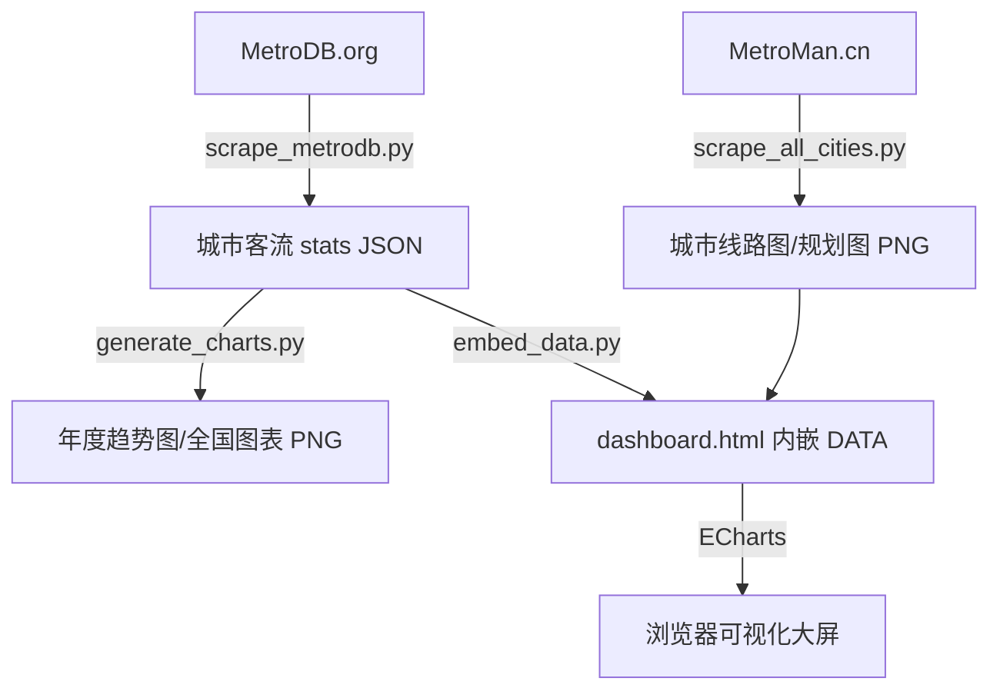
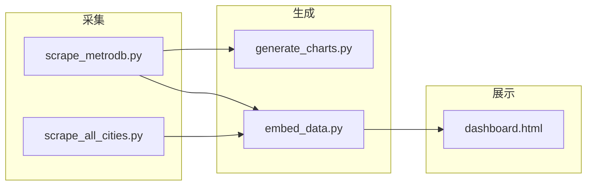
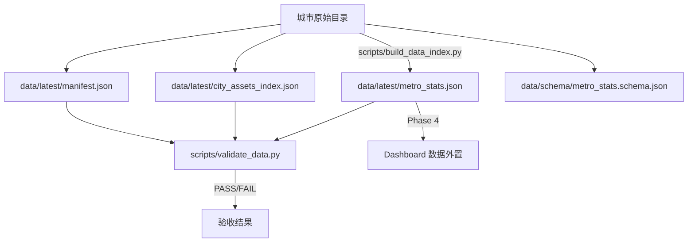

# 架构与数据流

## 整体数据流



## 各阶段详解

### 阶段一：线路图采集（MetroMan.cn → PNG）

| 项目 | 说明 |
|------|------|
| **数据源** | MetroMan.cn |
| **执行脚本** | `scrape_all_cities.py` |
| **输入** | MetroMan.cn 城市页面 URL（硬编码或配置） |
| **输出** | 各城市地铁线路图/规划图，PNG 格式，存储于 `assets/` 目录 |
| **覆盖范围** | 全部 48 个城市 |
| **依赖** | 网络连接、目标站点可访问 |

**说明：** 该脚本从 MetroMan.cn 抓取各城市的官方地铁线路图或规划示意图，保存为 PNG 文件。这些图片最终会被 dashboard.html 引用，在城市详情弹窗中展示。

### 阶段二：客流数据采集（MetroDB.org → JSON）

| 项目 | 说明 |
|------|------|
| **数据源** | MetroDB.org |
| **执行脚本** | `scrape_metrodb.py` |
| **输入** | MetroDB.org 城市客流页面 URL |
| **输出** | 各城市客流统计数据，JSON 格式 |
| **覆盖范围** | 34 个城市有数据，14 个城市标记为"无数据" |
| **依赖** | 网络连接、目标站点可访问 |

**说明：** 该脚本从 MetroDB.org 采集城市级客流统计数据，包括日均客流、年度客流等指标。对于 `daily_ridership_wan = 0` 的情况，视为缺失值而非真实零值，在可视化时不会展示为"客流为零"。

### 阶段三：趋势图生成（JSON → PNG）

| 项目 | 说明 |
|------|------|
| **执行脚本** | `generate_charts.py` |
| **输入** | 阶段二输出的 JSON 客流数据 |
| **输出** | 年度趋势图、全国对比图，PNG 格式 |
| **依赖** | matplotlib 或其他绑图库、阶段二的 JSON 数据 |

**说明：** 读取 JSON 数据，使用绑图库生成城市维度的年度客流趋势折线图和全国层面的对比图表。生成的 PNG 图片可嵌入大屏或用于报告。

### 阶段四：数据嵌入（JSON → dashboard.html）

| 项目 | 说明 |
|------|------|
| **执行脚本** | `embed_data.py` |
| **输入** | 阶段二的 JSON 客流数据 + 阶段一的 PNG 图片路径 |
| **输出** | `dashboard.html`（自包含，内嵌全部数据） |
| **依赖** | 阶段一、阶段二的产出物 |

**说明：** 将 JSON 数据以 JavaScript 变量形式直接写入 dashboard.html 文件，同时关联各城市的线路图 PNG 路径。最终生成的 dashboard.html 为自包含文件，无需额外数据文件即可独立运行。

### 阶段五：浏览器可视化（dashboard.html → 大屏）

| 项目 | 说明 |
|------|------|
| **运行环境** | 现代浏览器（Chrome、Firefox、Edge 等） |
| **核心技术** | ECharts 可视化库 |
| **输入** | dashboard.html 中内嵌的数据 |
| **输出** | 交互式可视化大屏 |

**说明：** 用户在浏览器中打开 dashboard.html，ECharts 读取内嵌数据渲染为中国地图散点图、城市列表、趋势图表等可视化组件。地图底图加载策略为：优先加载本地 `assets/china.json` → 失败则请求远程 CDN → 均失败则降级为城市列表表格。

## 依赖关系总结



**关键约束：**
- `generate_charts.py` 和 `embed_data.py` 均依赖 `scrape_metrodb.py` 的输出，必须先完成客流数据采集
- `embed_data.py` 还依赖 `scrape_all_cities.py` 的输出（线路图 PNG）
- `dashboard.html` 是最终产物，不依赖任何外部服务即可运行

---

## Phase 2：统一数据层

在原始城市目录基础上，建立统一的 `data/latest` 数据层，为后续 Dashboard 数据外置（Phase 4）提供标准化接口。



### 数据层文件

| 文件 | 说明 |
|------|------|
| `data/latest/metro_stats.json` | 汇总 34 个城市的客流统计数据 |
| `data/latest/city_assets_index.json` | 索引 48 个城市的资源文件（PNG/JSON） |
| `data/latest/manifest.json` | 数据层整体统计与元信息 |
| `data/schema/metro_stats.schema.json` | JSON Schema 定义 |

### 执行命令

```bash
# 构建数据索引
python scripts/build_data_index.py

# 校验数据完整性
python scripts/validate_data.py
```

### 设计原则

- **不修改原始数据**：`build_data_index.py` 只读取和汇总，不改变各城市目录下的原始文件
- **可重复执行**：每次运行覆盖 `data/latest/` 下的文件，结果确定
- **校验先行**：`validate_data.py` 独立于构建脚本，可单独运行
